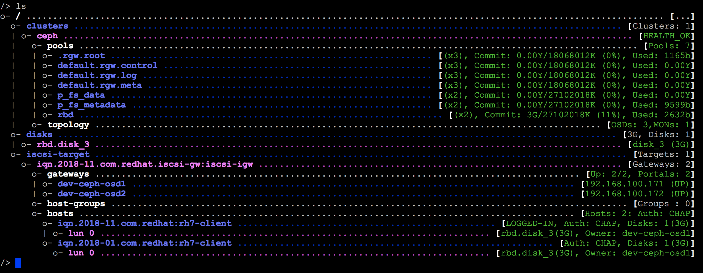

# 建置 RBD with iSCSI

### overview



參考文章：  
[http://docs.ceph.com/docs/mimic/rbd/iscsi-overview/](http://docs.ceph.com/docs/mimic/rbd/iscsi-overview/)


## Requirements

#### RBD pool create

```bash
[ceph-admin@ceph-mon afu]$ ceph osd pool create rbd 8
pool 'rbd' created

[ceph-admin@ceph-mon afu]$ rbd pool init rbd
[ceph-admin@ceph-mon afu]$ rbd create --image-feature layering --size 5120 rbd/rbd_image
[ceph-admin@ceph-mon afu]$ rbd ls
```

#### SYSTEM Common packages

```bash
sudo yum install gcc cmake git cmake libxslt-devel python-devel libnl3 kmod librbd1 glib2-devel libnl3-devel kmod-devel librbd1-devel librados2-devel python-kmod
curl https://bootstrap.pypa.io/get-pip.py -o get-pip.py && sudo python get-pip.py

vi requirments.txt
# 內容
    pyparsing
    kmod
    pyudev
    urwid
    netifaces
    crypto
    pycrypto
    requests
    flask
    pyOpenSSL
    netaddr

sudo pip install -r requirments.txt

# sudo yum install python-kmod python-pyudev python-gobject python-urwid python-rados python-rbd python-netaddr python-netifaces python-crypto python-requests python-flask pyOpenSSL
```

#### Firewall

```text
open TCP ports 3260 and 5000 on the firewall.
```

#### TCMU-RUNNER

```bash
# tcmu-runner
# https://github.com/open-iscsi/tcmu-runner
# Installation:
git clone https://github.com/open-iscsi/tcmu-runner
cd tcmu-runner
./extra/install_dep.sh
cmake -Dwith-glfs=false -Dwith-qcow=false -DSUPPORT_SYSTEMD=ON -DCMAKE_INSTALL_PREFIX=/usr
#make
sudo make install

#sudo mkdir /etc/tcmu/
#sudo cp tcmu.conf /etc/tcmu/tcmu.conf
sudo vi /etc/tcmu/tcmu.conf
    log_level = 3
    log_dir_path = "/var/log"

# Enable and start the daemon:
sudo systemctl daemon-reload
sudo systemctl enable tcmu-runner
sudo systemctl start tcmu-runner
```

#### RTSLIB-FB

```bash
git clone https://github.com/open-iscsi/rtslib-fb.git
cd rtslib-fb
sudo python setup.py install

# python module pyudev==0.15 > pyudev==0.21.0
# python module add rtslib-fb==2.1.69
```

#### CONFIGSHELL-FB

```bash
git clone https://github.com/open-iscsi/configshell-fb.git
cd configshell-fb
sudo python setup.py install

# python module add configshell-fb==1.1.25
```

#### TARGETCLI-FB

```bash
git clone https://github.com/open-iscsi/targetcli-fb.git
cd targetcli-fb
sudo python setup.py install
sudo mkdir /etc/target
sudo mkdir /var/target

# python module add targetcli-fb===2.1.fb49
```

#### CEPH-ISCSI

```bash
git clone https://github.com/ceph/ceph-iscsi.git
cd ceph-iscsi
sudo python setup.py install --install-scripts=/usr/bin
sudo cp usr/lib/systemd/system/rbd-target-gw.service /lib/systemd/system
sudo cp usr/lib/systemd/system/rbd-target-api.service /lib/systemd/system

# python module add  ceph-iscsi==3.0

sudo systemctl daemon-reload
sudo systemctl enable rbd-target-gw
sudo systemctl start rbd-target-gw
sudo systemctl enable rbd-target-api
sudo systemctl start rbd-target-api
```


iSCSI GW 服務安裝：  
[http://docs.ceph.com/docs/master/rbd/iscsi-target-cli-manual-install/](http://docs.ceph.com/docs/master/rbd/iscsi-target-cli-manual-install/)


## Configuring the iSCSI Target

#### 設定 API

```bash
# 兩台 API 角色皆需要設定。
sudo vi /etc/ceph/iscsi-gateway.cfg
##########################################################################################
[config]
# Name of the Ceph storage cluster. A suitable Ceph configuration file allowing
# access to the Ceph storage cluster from the gateway node is required, if not
# colocated on an OSD node.
cluster_name = ceph

# Place a copy of the ceph cluster's admin keyring in the gateway's /etc/ceph
# drectory and reference the filename here
gateway_keyring = ceph.client.admin.keyring


# API settings.
# The API supports a number of options that allow you to tailor it to your
# local environment. If you want to run the API under https, you will need to
# create cert/key files that are compatible for each iSCSI gateway node, that is
# not locked to a specific node. SSL cert and key files *must* be called
# 'iscsi-gateway.crt' and 'iscsi-gateway.key' and placed in the '/etc/ceph/' directory
# on *each* gateway node. With the SSL files in place, you can use 'api_secure = true'
# to switch to https mode.

# To support the API, the bear minimum settings are:
api_secure = false

# Additional API configuration options are as follows, defaults shown.
# api_user = admin
# api_password = admin
# api_port = 5000
trusted_ip_list = 192.168.100.171,192.168.100.172
##########################################################################################

sudo systemctl restart rbd-target-api
```

Go to iscsi-targets and create a target

```bash
[afu@dev-ceph-osd1 ~]$ sudo gwcli
Warning: Could not load preferences file /root/.gwcli/prefs.bin.
/> cd /iscsi-target
/iscsi-target> create iqn.2018-11.com.redhat.iscsi-gw:iscsi-igw
ok
```

Create the iSCSI gateways（必須兩台GW）

```bash
/iscsi-target> cd iqn.2018-11.com.redhat.iscsi-gw:iscsi-igw/gateways
/iscsi-target...-igw/gateways>
/iscsi-target...-igw/gateways> create dev-ceph-osd1 192.168.100.171 skipchecks=true
OS version/package checks have been bypassed
Adding gateway, syncing 0 disk(s) and 0 client(s)
ok

#增加另一台
/iscsi-target...-igw/gateways> create dev-ceph-osd2 192.168.100.172 skipchecks=true
OS version/package checks have been bypassed
Adding gateway, syncing 0 disk(s) and 0 client(s)
ok
```

Add RBD image

```bash
/iscsi-target...-igw/gateways>
/iscsi-target...-igw/gateways> cd /disks

/disks> create pool=rbd image=disk_3 size=3G
ok
```

Create a client with the initiator name

```text
/disks> cd /iscsi-target/iqn.2018-11.com.redhat.iscsi-gw:iscsi-igw/hosts
/iscsi-target...csi-igw/hosts>
/iscsi-target...csi-igw/hosts> create iqn.2018-11.com.redhat:rh7-client
ok
```

Set the client’s CHAP username to myiscsiusername and password to myiscsipassword

```text
/iscsi-target...at:rh7-client> auth chap=myiscsiusername/myiscsipassword
ok
```

Add the disk to the client

```bash
/iscsi-target...at:rh7-client> disk add rbd.disk_3
ok
```

#### 嘗試新增第二台 

```bash
/> cd iscsi-target/iqn.2018-11.com.redhat.iscsi-gw:iscsi-igw/hosts/
/iscsi-target...csi-igw/hosts> create iqn.2018-01.com.redhat:rh7-client
ok
/iscsi-target...at:rh7-client> auth chap=deviscsiusername/deviscsipassword
ok
/iscsi-target...at:rh7-client> disk add rbd.disk_3
Warning: 'rbd.disk_3' mapped to 1 other client(s)
ok
/iscsi-target...at:rh7-client> ls
o- iqn.2018-01.com.redhat:rh7-client .................................................................... [Auth: CHAP, Disks: 1(3G)]
  o- lun 0 .................................................................................. [rbd.disk_3(3G), Owner: dev-ceph-osd1]
/iscsi-target...at:rh7-client>
```



如果要移除上述設定，方式

```bash
/iscsi-target> clearconfig confirm=true
```

## Configuring the iSCSI Initiators

### **Prerequisite**

```bash
sudo yum install iscsi-initiator-utils device-mapper-multipath
```

#### Create the default `/etc/multipath.conf` file and enable the `multipathd` service

```bash
sudo mpathconf --enable --with_multipathd y
```

#### Add the following to `/etc/multipath.conf` file Restart the `multipathd` service

```bash
sudo vi /etc/multipath.conf

devices {
        device {
                vendor                 "LIO-ORG"
                hardware_handler       "1 alua"
                path_grouping_policy   "failover"
                path_selector          "queue-length 0"
                failback               60
                path_checker           tur
                prio                   alua
                prio_args              exclusive_pref_bit
                fast_io_fail_tmo       25
                no_path_retry          queue
        }
}

sudo systemctl reload multipathd
```

### **iSCSI Discovery and Setup**

#### CHAP username and password by updating the `/etc/iscsi/iscsid.conf` file 修改 initiator 名字 /etc/iscsi/initiatorname.iscsi

```bash
sudo vi /etc/iscsi/iscsid.conf
# *************
# CHAP Settings
# *************
node.session.auth.authmethod = CHAP
node.session.auth.username = myiscsiusername
node.session.auth.password = myiscsipassword

sudo vi /etc/iscsi/initiatorname.iscsi
InitiatorName=iqn.2018-11.com.redhat:rh7-client
```

#### Discover the target portals Login to target

```bash
[afu@iscsi-client ~]$ sudo iscsiadm -m discovery -t st -p 192.168.100.171
192.168.100.171:3260,1 iqn.2018-11.com.redhat.iscsi-gw:iscsi-igw
192.168.100.172:3260,2 iqn.2018-11.com.redhat.iscsi-gw:iscsi-igw

iscsiadm -m node [ -hV ] [ -d debug_level ] [ -P printlevel ] [ -L all,manual,automatic ] [ -U all,manual,automatic ] [ -S ] [ [ -T targetname -p ip:port -I ifaceN ] [ -l | -u | -R | -s] ] [ [ -o  operation  ] [ -n name ] [ -v value ] ]

[afu@iscsi-client ~]$ sudo iscsiadm -m node -T iqn.2018-11.com.redhat.iscsi-gw:iscsi-igw -l
Logging in to [iface: default, target: iqn.2018-11.com.redhat.iscsi-gw:iscsi-igw, portal: 192.168.100.171,3260] (multiple)
Logging in to [iface: default, target: iqn.2018-11.com.redhat.iscsi-gw:iscsi-igw, portal: 192.168.100.172,3260] (multiple)
Login to [iface: default, target: iqn.2018-11.com.redhat.iscsi-gw:iscsi-igw, portal: 192.168.100.171,3260] successful.
Login to [iface: default, target: iqn.2018-11.com.redhat.iscsi-gw:iscsi-igw, portal: 192.168.100.172,3260] successful.
[afu@iscsi-client ~]$
```

### **Multipath IO Setup**

```bash
[afu@iscsi-client ~]$ sudo multipath -ll
mpatha (360014053721efca21534f70a7c1368ce) dm-2 LIO-ORG ,TCMU device
size=3.0G features='1 queue_if_no_path' hwhandler='1 alua' wp=rw
|-+- policy='queue-length 0' prio=50 status=active
| `- 33:0:0:0 sdc 8:32 active ready running
`-+- policy='queue-length 0' prio=10 status=enabled
  `- 34:0:0:0 sdb 8:16 active ready running
  
[afu@iscsi-client ~]$ sudo fdisk -l

Disk /dev/sdb: 3221 MB, 3221225472 bytes, 6291456 sectors
Units = sectors of 1 * 512 = 512 bytes
Sector size (logical/physical): 512 bytes / 512 bytes
I/O size (minimum/optimal): 512 bytes / 524288 bytes

Disk /dev/sdc: 3221 MB, 3221225472 bytes, 6291456 sectors
Units = sectors of 1 * 512 = 512 bytes
Sector size (logical/physical): 512 bytes / 512 bytes
I/O size (minimum/optimal): 512 bytes / 524288 bytes

Disk /dev/mapper/mpatha: 3221 MB, 3221225472 bytes, 6291456 sectors
Units = sectors of 1 * 512 = 512 bytes
Sector size (logical/physical): 512 bytes / 512 bytes
I/O size (minimum/optimal): 512 bytes / 524288 bytes
```

## Monitoring the iSCSI Gateways

Install /  running in Ceph iSCSI gateway

```bash
git clone https://github.com/ceph/ceph-iscsi-tools.git
cd ceph-iscsi-tools
sudo python setup.py install --install-scripts=/usr/bin

sudo yum install pcp pcp-pmda-lio
sudo systemctl enable pmcd && sudo systemctl start pmcd

# register the pcp-pmda-lio agent
cd /var/lib/pcp/pmdas/lio
sudo ./Install
```

GWTOP

```bash
[afu@dev-ceph-osd1 ~]$ gwtop
Error: Unable to connect to pmcd daemon on dev-ceph-osd2

gwtop  1/2 Gateway    CPU% MIN:  0 MAX:  0    Network Total In:    0K  Out:    0K   NO DATA
Capacity:   3G    Disks:   1   IOPS:    0   Clients:  1   Ceph: HEALTH_WARN        OSDs:   3
Pool.Image    Src    Size     iops     rMB/s     wMB/s   Client
rbd.disk_3             3G        0      0.00      0.00   iscsi-client(CON)
#############################################################################################
gwtop  2/2 Gateways   CPU% MIN:  0 MAX:  0    Network Total In:    0K  Out:    0K   NO DATA
Capacity:   3G    Disks:   1   IOPS:    0   Clients:  1   Ceph: HEALTH_WARN        OSDs:   3
Pool.Image    Src    Size     iops     rMB/s     wMB/s   Client
rbd.disk_3             3G        0      0.00      0.00   iscsi-client(CON)
```

觀察

```bash
[root@dev-jmeter01 afu]# lsscsi
[0:0:0:0]    disk    VMware   Virtual disk     2.0   /dev/sda
[3:0:0:0]    cd/dvd  NECVMWar VMware SATA CD00 1.00  /dev/sr0
[33:0:0:0]   disk    LIO-ORG  TCMU device      0002  /dev/sdb
[34:0:0:0]   disk    LIO-ORG  TCMU device      0002  /dev/sdc

[root@dev-jmeter01 afu]# ls -l /dev/disk/by-*
/dev/disk/by-path:
total 0
lrwxrwxrwx 1 root root  9 Nov 23 22:59 ip-192.168.100.171:3260-iscsi-iqn.2018-11.com.redhat.iscsi-gw:iscsi-igw-lun-0 -> ../../sdb
lrwxrwxrwx 1 root root  9 Nov 23 22:59 ip-192.168.100.172:3260-iscsi-iqn.2018-11.com.redhat.iscsi-gw:iscsi-igw-lun-0 -> ../../sdc
lrwxrwxrwx 1 root root  9 Nov 23 22:58 pci-0000:02:03.0-ata-1.0 -> ../../sr0
lrwxrwxrwx 1 root root  9 Nov 23 22:59 pci-0000:03:00.0-scsi-0:0:0:0 -> ../../sda
lrwxrwxrwx 1 root root 10 Nov 23 22:58 pci-0000:03:00.0-scsi-0:0:0:0-part1 -> ../../sda1
lrwxrwxrwx 1 root root 10 Nov 23 22:58 pci-0000:03:00.0-scsi-0:0:0:0-part2 -> ../../sda2
```


