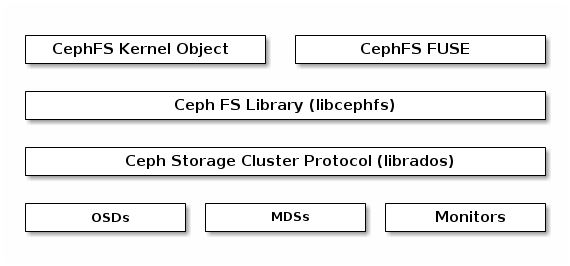

# Ceph Metadata Server \(MDS\) Architecture

* MDSs
  * 提供Ceph文件系統存儲元數據。
  * Ceph 元數據服務器允許 POSIX 文件系統用戶執行基本命令（如ls、find等），而不會給 Ceph 存儲集群帶來巨大負擔。
  * CPU 需求稍高 8 核心、每进程 1GB。


文章參考：  
[http://docs.ceph.com/docs/giant/architecture/](http://docs.ceph.com/docs/giant/architecture/)


